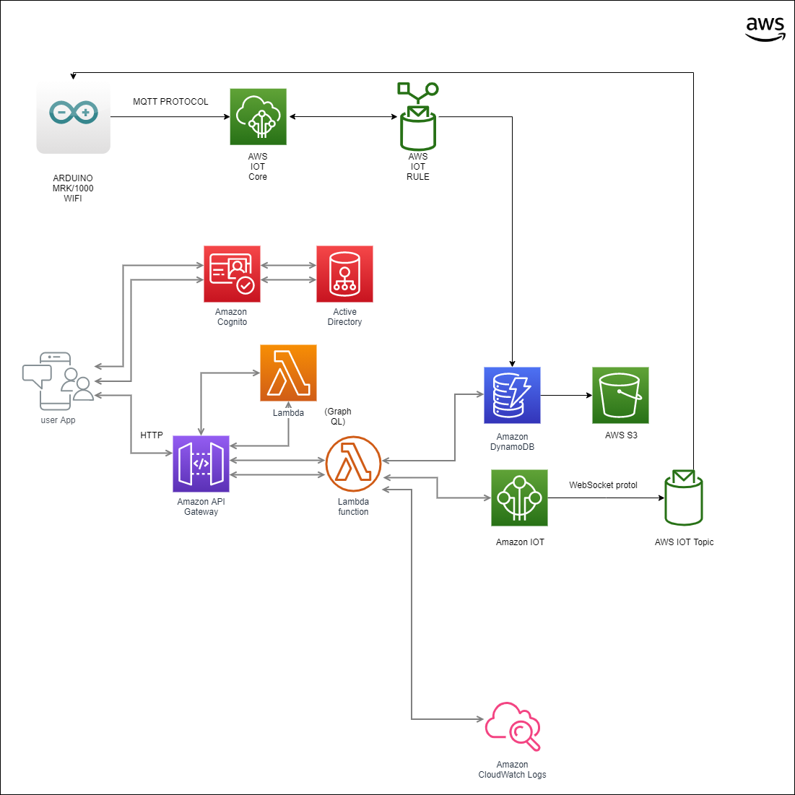

# AWS Lambda Serverless - LightArduino

## Vision general 
EL Proyecto AWS Lambda Serverless - LightArduino, tiene como objetivo principal de ser el intermedio entre la aplicacion movil ligthArduino y el dispositivo prototipo arduino.
## Tecnologias Utilizadas
* [NodeJS](https://nodejs.org/en/)
* [Visual Studio Code IDE](https://code.visualstudio.com/)
* [JavaScript](https://www.javascript.com/)
* [ServerlessFramwork] (https://serverless.com/)
* [Amazon Web Services](https://aws.amazon.com/es/)
* [Github] (https://github.com)
* [Firebase Cloud Messaging](https://firebase.google.com/docs/cloud-messaging)
## Configuracion del Proyecto AWS Lambda Serverless - LightArduino

1. Descarga e instala [NodeJS](https://nodejs.org/en/).
2. Descarga e instala y configura localmente * [Amazon Web Services CLI](https://aws.amazon.com/ s/)
3. Descarga e instala [Visual Studio Code IDE](https://code.visualstudio.com/).
4. Descarga e instala [GIT](https://git-scm.com/).
5. clona este repositorio [AWS Lambda Serverless](https://github.com/cb161769/aws-lambda-serverless-Functional)
6. Abre el proyecto desde Visual Studio Code.
7. luego ejecuta el siguente 
script: `npm install`
8. por ultimo ejecuta el siguente
script: `sls deploy`

## Log

Se encargan de imprimir los mensajes que se van a visualiar en *[Amazon Web Services CloudWatch](https://aws.amazon.com/es/cloudwatch/) 
```javascript 
const cloudwatchConfig = {
    logGroupName: config.LogGroups.Database.LogGroupName,
    logStreamName: `aws-serverles-api-${new Date().toISOString()}`,
    cloudWatchLogs: new   AWS.CloudWatchLogs(),
    messageFormatter: ({ level, message, additionalInfo }) =>    `[${level}] : ${message} \nInformacion Adicional: ${JSON.stringify(additionalInfo)}}`
}
    logger.add(new WinstonCloudWatch(cloudwatchConfig))
```
## Estructura del proyecto
* `.vscode`: contiene los archivos de configuración para el IDE de Visual Studio Code.
* `functions`: contiene los archivos de las funciones auxiliares del proyecto
* `helpers`: contiene los archivos para ayuda del calculo de las funciones.
* `models`: contiene los modelos que se van a manejar en el proyecto.
* `routes`: contiene las rutas HTTPS para ser utilizadas en el proyecto.
* `sns`: contiene los archivos de sns del proyecto.
* `src/index`: es el archivo principal del proyecto.
* `tensorflow`: contiene todos los archivos relacionado a el modelo predictivo de tensorflow
* `handler.js`: es el archivo de inicio del proyecto
* `job`: contiene todos los archivos relacionado a la configuracion de las tareas programadas.

